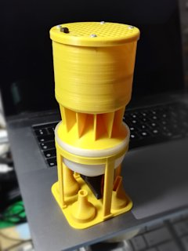
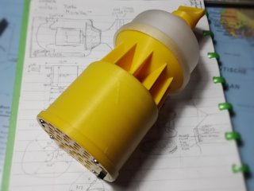
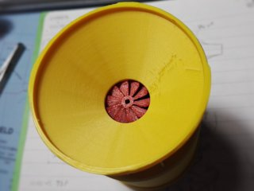
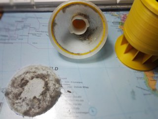
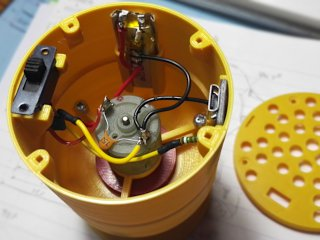
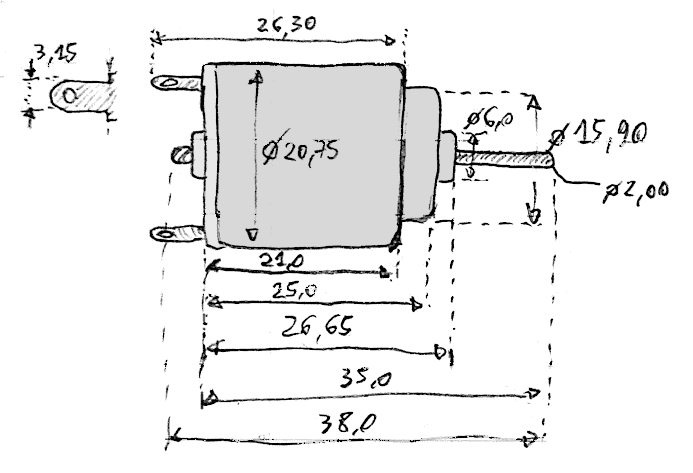
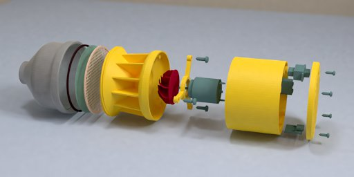
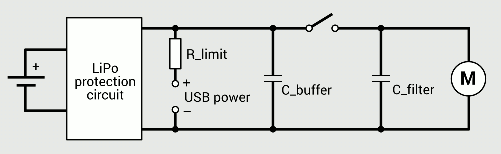

# MicroVac Turbo
*A small (experimental) 3D printed handheld vacuum cleaner made from scrap parts*

### License
[Creative Commons - Attribution](https://creativecommons.org/licenses/by/4.0/)

### Gallery

[🔎](images/microvac1.jpg) [🔎](images/microvac2.jpg) [🔎](images/microvac3.jpg) [🔎](images/microvac4.jpg) [🔎](images/microvac5.jpg)

## Description and Instructions

This is a small (about 60 mm diameter and 150 mm tall) handheld vacuum cleaner that I basically made from scrap parts. It is more like a proof-of-concept and was designed to fit the parts I had, not to use commonly available components. It is unlikely you will be able to print and build this without first modifying the 3D models, because the motor I used may not be easy to find, and the LiPo battery I used certainly is not easy to find.

This mini vacuum cleaner is built around a turbo style impeller, just because I wanted to see how well it would work (pretty well apparently). After trying out a few impeller designs from other people, I created my own. This was done purely by eyeballing and wet-finger guessing, it probably isn't the most efficient design possible but it works pretty well for this application.

The vacuum cleaner itself is a very basic design, no fancy cyclones (if there is cyclone action, it would be by accident), just a widening collector to slow down the air and provide a relatively large filter area. I didn't expect much of it but it works surprisingly well and is useful for cleaning keyboards or electronic devices and hard to reach corners. It isn't ideal to suck up a lot of fluffy dust because this quickly clogs the filter, but it is great to quickly get rid of small pieces of junk. When sanding or carving something, I no longer care about the mess I make, I just vacuum it afterwards. It's also useful to clean the inside of a confined space like a 3D printer enclosure. This is one of the most useful 3D prints I have made so far.

Note: there is no relation between this freely available 3D printable model and any products or brands that may use the MicroVac name. This model is not condoned or endorsed by any company.

### Parts

IIRC the motor I used came from SparkFun long ago and they no longer sell this model at the time of this writing. The specifications were:
- 1.5V to 4.5V,
- 8400 rpm at 1.5V, 230 mA
- 14200 rpm at 3V, 280 mA
- 2 mm axle diameter
- Overall diameter: 20.75 mm, front diameter (around axle) 15.90 mm

Any motor with roughly similar specs and dimensions should be suitable. Unless you're extremely lucky with the dimensions, you will need to model your own motor mount. It may be a good idea to try a *drone motor* which will certainly be able to displace a lot of air. However, keep in mind that there will be an upper limit to the speed you can drive the impeller before it explodes into bits. Make sure to wear eye protection if you plan to find this speed limit… Also consider that the impeller will tend to spin faster inside the enclosure than in free air, especially when the inlet is obstructed.

The battery I used is a 220 mAh 551240 LiPo which came from a Chinese ‘spy pen’ gadget, the one [I reviewed here](https://www.dr-lex.be/hardware/spypen_review.html). After the protection circuit of this battery failed, I tried to find a replacement and this proved very difficult. This bare battery remained in my stockpile of loose parts until I decided to use it for this project, with a basic protection circuit attached to it. In other words, you will likely need to adapt the 3D model to fit a battery you can easily obtain. A slightly higher capacity than 220 mAh may be recommended although autonomy is pretty decent even with this small value.

The switch is a pretty standard 2P2T slide switch, a classic model that has been around for ages and should still be easy to find. I connected the two arrays of contacts together because the currents it has to deal with may be a little higher than it is intended for. So far, no problems whatsoever.

For the USB socket. I used a simple microUSB break-out board that is easy to find on AliExpress and the like, the dimensions are 14.1x12.7 mm. Of course you could use any other connector, USB-C if you want to be fancy. You could also look for a combination charge/discharge protection board that does everything to keep the battery in good shape and offers an indicator light.

You also need some kind of *filter.* The 3D printed ‘filter’ is insufficient, its only purpose is to hold the actual finer filter in place. The filter should be a circle with 60 mm diameter, and it should be the thinnest possible material that still blocks fine dust. I simply peel and cut one layer from soft multi-ply toilet paper, which works very well.

### Printing

The recommended layer height for nearly all parts is 0.2 mm. Only the impeller should be printed at 0.1 mm layers with an extrusion width of 0.4 mm. For the other parts I recommend an extrusion width of 0.6 mm, which will be beneficial for strength. Since all parts are basically shells, infill doesn't really matter and safest is to use 100%.

I used PLA for all parts except the filter ring (see below) and the impeller, which is ABS. The only real reason for this is that I'm able to produce more detailed prints with ABS. Use whatever works best for you.

It is highly recommended to print the `FilterRing` in an *elastic filament* like TPU. Otherwise there may be a considerable air leak around the filter edges. Whether you need **one** or **two** of these filter rings, depends on how flat and smooth you can make the interface between the `CenterPart` and `Filter` parts. If it is perfectly flat, this interface will offer a good enough seal on its own, otherwise an extra gasket is recommended. In my case the surfaces are perfect because I print on a glass bed, but an alternative is to sand and polish these two surfaces.

The impeller is provided in two versions: the `clockwise` version is to be used if the axle of your motor turns clockwise when viewed from the front. (In many cases you could of course just swap the wires if you printed the wrong version.)

There are two lid designs, `cheese` has a pattern with round holes, `grid` is a regular grid and in theory offers slightly better airflow.

Several mouthpiece styles are available. The most useful ones proved to be 3, 4, and 5. These are press-fit, which means you might need to experiment a bit with scale factors to get a good fit. In my case, I have to scale these pieces to 99.5% in the XY plane to get a good fit. I printed the number 4 piece in flexible PLA to reduce the risk of scratching things.

A stand is also provided that can hold up to 4 mouthpieces besides the vac itself. When printed well, the two parts will fit and hold together when pushed into each other, otherwise sandpaper and/or glue are your friends.

### Assembly

[🔎](images/assembly.jpg)

Assembly is rather straightforward. You should start by pushing the motor into its mount (it's press-fit) and then mounting the impeller. Tune the position of the impeller on the axle such that it just does not scrape against the intake part, also not when the airflow is blocked and the motor spins at its highest speed. When this is OK, assemble the other parts.

Cut a fine 60 mm diameter filter out of some thin material, like a single ply of soft toilet paper. You can use the coarse filter as a template. Place this thin filter on top of the coarse filter, preferably at the top side where the grid is slightly recessed. Then place the flexible ring on top of the fine filter and align everything. While keeping the set of filters in this orientation, insert them into the collector with its outlet pointing upwards. If you decided to use two flexible rings, place the second ring onto the coarse filter. Then screw the collector onto the main body of the vacuum cleaner.

The inlet has a tab on the side, the idea was to stick a piece of paper or plastic sheet to it, to act as a valve. This has proven unnecessary though when emptying the collector regularly. Junk will typically move to the sides and not fall back into the inlet unless too much has been collected.

#### Wiring

How to wire this thing, will depend on the specific parts used, but in general it is rather straightforward. One wire of the motor goes to common ground, the other goes through a switch to the positive terminal of the battery protection circuit. The positive terminal of the battery's over-voltage protection circuit goes to a charging port. Ideally there should also be a current regulator to limit the current during charging. Usually, a good rule of thumb for the charge current is the same milli-amperes value as the battery's capacity in mAh (or “1 C”). In my case, the current limiter is extremely simple: a resistor chosen such that the peak current is not much higher than 1 C. This is inefficient, but OK given the small capacity of the battery I'm using and the low current it charges at. For a higher capacity battery, you will want to use some active charging circuit, because a resistor could become dangerously hot.

There are some ready-to-use boards that have a microUSB (maybe nowadays even USB-C) port with charge and protection circuit all-in, but you will need to modify the 3D models to fit those.

If you cannot find a motor that runs at a good speed between 3.8 and 4.2 V, you will have to add some kind of booster circuit.

Refinements that are good practice: ensure there is a small ceramic capacitor as close to the motor terminals as possible, to filter out noise (may not be needed depending on the type of motor). Also, a decently sized capacitor across the battery (I used 470 nF), to buffer the initial inrush current when switching on the motor. This should also be placed as near to the motor as possible but must come before the switch. Without this capacitor, the protection circuit of my battery would sometimes engage because the inrush current could be high enough for the protection circuit to consider it a short-circuit.

### Using

There isn't much to say about how to vacuum things, just turn it on and go for it. If you didn't make a valve to keep dirt inside, the only thing you should avoid is wildly shaking the device or allowing it to fill up to a point where dirt can no longer stay inside.

Depending on your wiring, you may be able to get an extra boost by connecting the USB cable. In my case the gain is minimal due to the rather high impedance of my barebones current limiter. Make sure you cannot send the motor into explosive overdrive when it receives 5 V instead of the usual 4.2 V maximum of a LiPo battery.

To empty the reservoir, unscrew the collector from the rest, obviously while keeping it upright. Then either take out the filters using tweezers, or just immediately topple the whole thing over above a dustbin, catching the filters with your hand. If you're careful, you can shake the fine filter and reuse it, but the effort to make new filters is pretty small anyway. Afterwards, reassemble according to the above instructions.

The mounting/removing of the filters and the screw thread connection to mount the collector aren't very user-friendly, but this was only a proof-of-concept after all.
